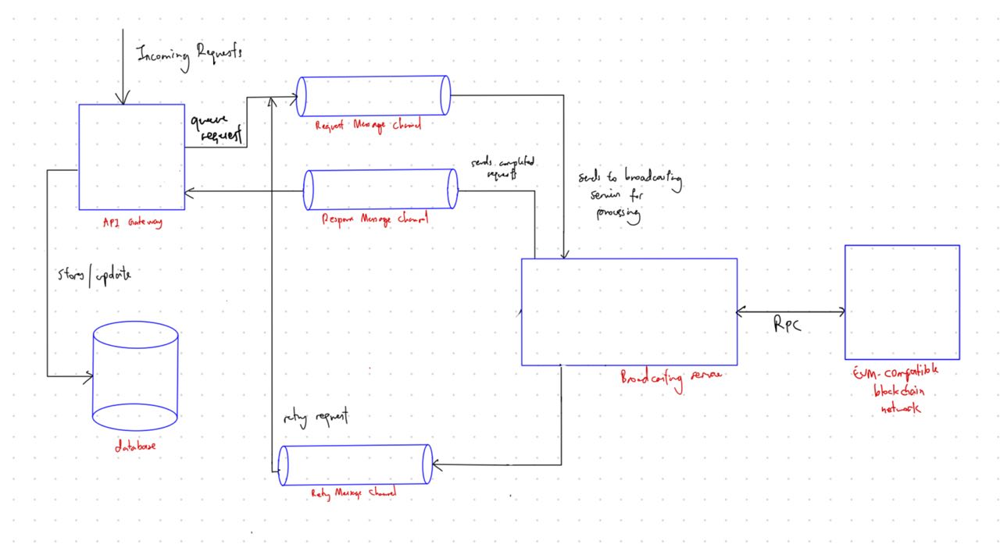

### Frontend Overview
- **Admin Interface**: A dashboard for administrators to view and manage broadcast messages from the database. It allows the resending of failed broadcasts, which the broadcasting service treats as new messages rather than retries.

----

### Backend Architecture

#### Service A (API Gateway)
1. **POST Request Handling**:
   - Receives and validates transaction data in POST requests.
   - Returns HTTP 400 Bad Request for validation failures.
2. **Message Channeling**:
   - Forwards valid transactions to the "Request" message channel.
   - Confirms successful transmission to Service B with HTTP 200 OK.
3. **Database Operations**:
   - Stores transaction details in the database (fields: `txn_id`, `txn_details`, `status`, `attempt_count`, `timestamp`).
   - Awaits responses from Service B via the "Response" message channel.
   - Updates transactions in the database based on responses using `txn_id`.
   - NoSQL database like MongoDB

#### Service B (Broadcasting Transaction Service)
1. **Startup and Recovery**:
   - At startup, checks for unprocessed transactions in the database and re-queues them for broadcasting.
2. **Broadcasting Logic**:
   - Broadcasts signed transactions to an EVM-compatible blockchain network using RPC.
   - Manages concurrency through asynchronous methods and a worker pool pattern, able to process multiple transactions concurrently.
       - Worker Pool Pattern: Create a fixed number of goroutines (workers) that listen on the retry channel. These workers process messages as they come in. This approach limits the number of concurrent operations, providing a safeguard against resource exhaustion. 
     

3. **Retry Mechanism**:
   - Handles failed broadcasts (less than 3 attempts) by incrementing the attempt count and re-queuing in the "Retry" message channel.
   - For broadcasts exceeding 3 attempts, sends a failure response back to Service A.
   -   _For retry broadcasting, there will be a need to re-sign the transaction_
4. **Success and Failure Responses**:
   - On successful broadcast, sends a success response to Service A.
   - On failure (after 3 attempts), sends a failure response with relevant metadata, for Service A to update the transaction details.

 

### Communication Flow and Channels
1. **Main Requests Channel**:
   - Facilitates new requests from Service A to B. Service B processes these requests upon receipt.
   - Retries attempts are prioritised first so that the conditions of signing are the same for example gas prices.
2. **Main Responses Channel**:
   - Service B uses this channel to send back responses to Service A after processing requests.
3. **Retry Attempts Channel**:
   - Manages failed transactions requiring retries, by sending it back to the Main Request Channel

### Processing and Response Mechanism
- **Service B Processing**: Handles requests from the Main Requests Channel.
- **Response Transmission**: Sends responses through the Main Responses Channel.
- **Service A Reception**: Receives responses, completes the request-response cycle, and updates the database.

### Database Schema (Service A)
- **Transactions Table**:
   - `txn_id`: Unique identifier.
   - `txn_details`: Details of the transaction.
   - `status`: Status of the transaction (pending, success, failed).
   - `attempt_count`: Number of broadcast attempts.
   - `timestamp`: Creation time of the transaction.

### HTTP Status Codes and Responses
- **200 OK**: Indicating successful interactions between services.
- **400 Bad Request**: For data validation errors at Service A.
- **500 Internal Server Error**: For unhandled exceptions or failures in either service.

### Metadata and Error Handling
- **For Service B to A Responses**:
   - Includes `status`, `message`, and `attempt_count`.
- **Retry Logic Metadata**:
   - Contains `txn_id`, `attempt_count`, and error specifics.

-----

### Scenario 1: First Attempt and Success
1. **Initiation**: An admin submits a new transaction via the admin interface. This POST request is received by Service A (API Gateway).
2. **Validation and Forwarding**: Service A validates the transaction data. Finding no errors, it forwards the transaction to the "Request" message channel and stores its details in the MongoDB database (status set as 'pending').
3. **Broadcasting**: Service B (Broadcasting Transaction Service) picks up the transaction from the channel. It successfully broadcasts the transaction to the EVM-compatible blockchain network on the first attempt.
4. **Response and Update**: Service B sends a success response back to Service A via the Main Responses Channel, including the `status: success` and `attempt_count: 1`.
5. **Database Update**: Service A receives this response and updates the transaction record in the database, marking the status as 'success'.

### Scenario 2: Retried Once and Success
1. **Transaction Submission**: An admin sends a transaction through the admin interface, which is received by Service A.
2. **Processing by Service A**: After validating the data, Service A forwards the transaction to Service B and logs it in the database with the status 'pending'.
3. **First Attempt Failure**: Service B tries to broadcast the transaction but encounters an issue, leading to a failure.
4. **Retry Mechanism Activation**: Service B sends the transaction to the "Retry" message channel, incrementing the `attempt_count` to 1.
5. **Second Attempt Success**: The transaction is re-queued and processed again by Service B. This time, the broadcast is successful.
6. **Final Update**: Service B sends a success response back to Service A, which then updates the transaction status in the database to 'success' and records the `attempt_count: 2`.

### Scenario 3: Retried 3 Times and Failed
1. **Initial Submission**: An admin submits a transaction request, which Service A validates and forwards to Service B after logging it in the database.
2. **Consecutive Failures**: Service B attempts to broadcast the transaction but fails. It retries twice more, each time incrementing the `attempt_count` and using the "Retry" message channel.
3. **Final Attempt and Failure**: On the third retry (fourth attempt overall), Service B again fails to broadcast the transaction.
4. **Failure Response**: Service B sends a failure response to Service A, indicating the transaction could not be broadcasted even after multiple attempts (`status: failed`, `attempt_count: 4`).
5. **Database Status Update**: Service A updates the transaction record in the database to reflect the failure and records the final `attempt_count`.

